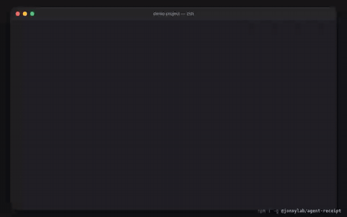

# agent-receipt

See what your coding agent actually changed — **including files touched by Bash** — and restore them one file at a time.

Claude Code's `/rewind` only tracks its own file-editing tools: "Checkpointing does not track files modified by Bash
commands." agent-receipt snapshots your project folder around every Bash/Write/Edit call, so an `rm -rf` or a `git clean`
shows up on a receipt and can be undone — including untracked and gitignored files like `.env`.



## Install

```sh
npm install -g @jonnylab/agent-receipt
agent-receipt init
```

`init` adds observe-only hooks to `~/.claude/settings.json` and backs up the file first. The hooks never block, delay, or
change what the agent does — they only watch. Remove them any time with `agent-receipt uninstall`.

A global install is deliberate: the hooks need a stable path to call, and npx cache paths get garbage-collected, so `init`
refuses to wire one.

## Use it

Work in Claude Code as usual, then:

```sh
agent-receipt show                     # what happened in this project's last session
agent-receipt restore last --deleted   # bring the deleted files back
```

```
AGENT RECEIPT  claude-code · 2026-09-17 14:02–14:31
<my-app>
────────────────────────────────────────────────────────────────
DELETED     3
   .env restorable  ← Bash: rm -rf build .env
   notes/todo.md restorable  ← Bash: rm -rf build .env
MODIFIED    2
CREATED     1
────────────────────────────────────────────────────────────────
COMMANDS   14   ⚠ 1 high risk
   ⚠ rm -rf build .env  (recursive_delete, secret_file)
COST      ≈ $1.84 est.  2.1M tokens, list price
────────────────────────────────────────────────────────────────
restore:  agent-receipt restore <session> --deleted
```

Restoring is itself reversible — the previous contents are saved before anything is written back.

## Commands

| Command | What it does |
|---|---|
| `init` / `uninstall` | Add or remove the Claude Code hooks (`--project` for this repo only, `--yes` to skip prompts) |
| `list` | Recent sessions |
| `show [session\|last]` | Build and print the receipt (`--share` masks paths and secrets, `--json`, `--all`) |
| `restore [session\|last] [paths...]` | Restore files (`--deleted`, `--modified`, `--include-created`, `--force`, `--yes`) |
| `verify [session\|last]` | Check the session's event hash chain |
| `telemetry [on\|off]` | Show or change the opt-in anonymous ping |

## Privacy

Everything stays on your machine. Receipts, snapshots, and the event ledger live in `~/.agent-receipt` (0700, override
with `AGENT_RECEIPT_HOME`). Snapshots can contain secrets — that is the point, it is how `.env` comes back — so the
directory is private and content is pruned on a retention window. `--share` masks paths and secret-looking values before
you post a receipt anywhere.

Telemetry is **off unless you opt in** at `init`, and it is two events for the entire life of the install: `installed`,
and `third_receipt` the first time you have produced three receipts. Run `agent-receipt telemetry` to see the exact
payload. It is only ever this:

```json
{
  "install_id": "a random uuid, created on opt-in and deleted when you opt out",
  "event": "third_receipt",
  "version": "0.0.3",
  "platform": "darwin",
  "days": 2
}
```

No file names, no paths, no commands, no project or machine names, no content. `agent-receipt telemetry off` deletes the
id and stops everything. If you never opt in, no id is ever created.

## What it does not see

Changes outside the project folder, network effects, content of files over 5 MB, `.git` and `node_modules`. Sessions that
started before `init` are not recorded, and costs are estimates at list price.

## Status

Pre-release (v0, Claude Code only). Codex and Cursor adapters are not built yet.

Issues and feedback: https://github.com/iamjohn96/agent-receipt/issues

## License

Apache-2.0
